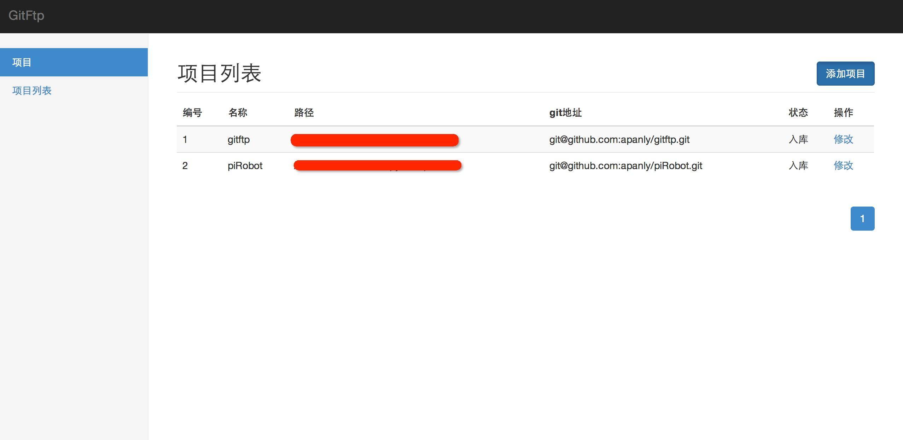
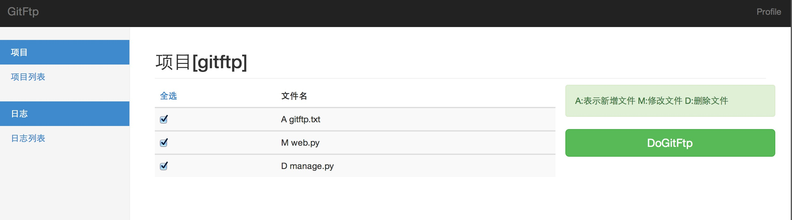
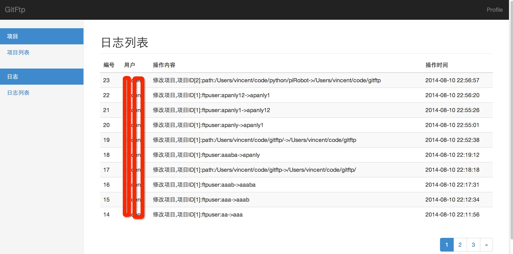

gitftp
=================

* 目前的虚拟主机每次上传文件挺麻烦的需要自己记住，gitftp项目就是为了通过git记录变动文件,然后通过自动化管理上传更新文件到虚拟主机中去

* 可以使用git hook 在git仓库初始化或者clone的时候，直接将项目注册到数据库

How to use
==================
* pip install -r requirements.txt
* python manage.py -c
* python manage.py


Use It For
==================
- Local
  - [X] Common git operations (add, rm, mv, commit, log)

系统预览图
=================





